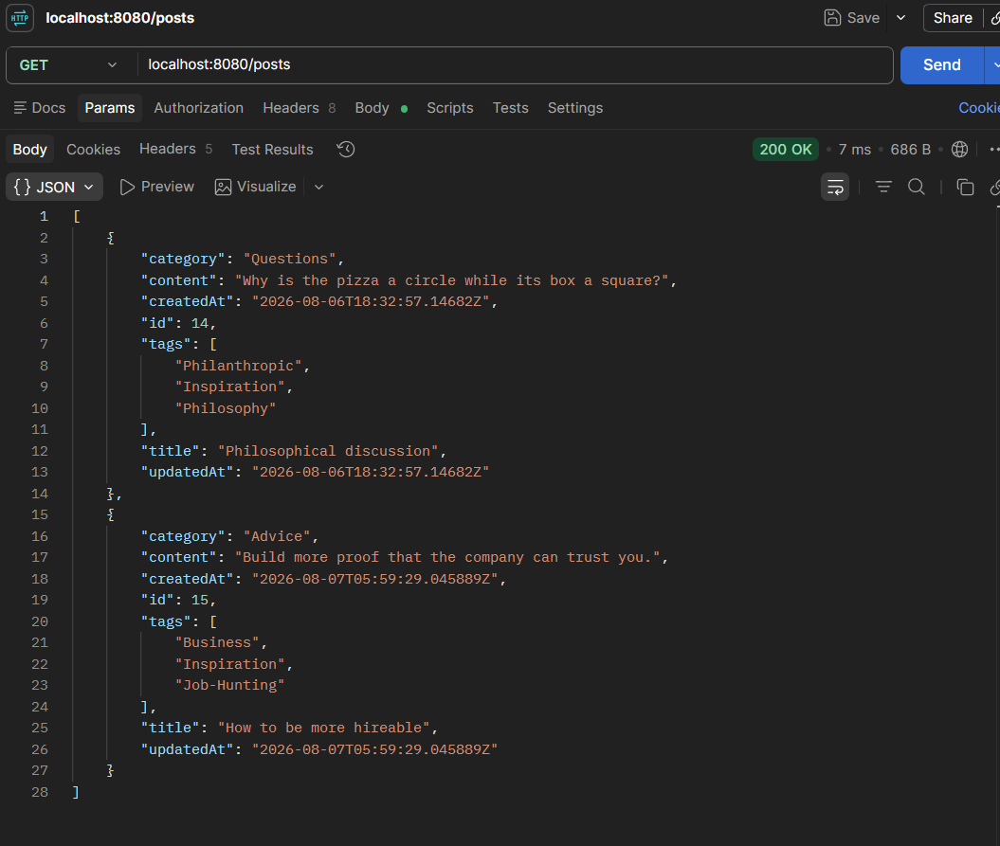
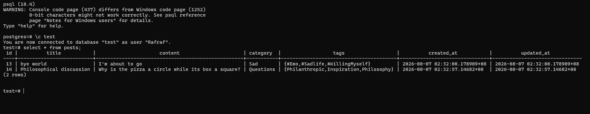

# blogging-platform-api
 A simple CRUD API where you can add, update, delete and get your blogs.

## Introduction
This is my take on the [Blogging Platform API](https://roadmap.sh/projects/blogging-platform-api)
as one of the beginner projects in [roadmap.sh](https://roadmap.sh). I learned a lot about the 
weird specifics of PostgreSQL's JDBC Driver. Like for example how you can't map a java.time.Instant
class to a Postgres' timestamptz, but you can with java.time.OffsetDateTime. Consequently, I learned a lot
more about Java's time and date API. And I also learned more about JdbcTemplate, like how 
JdbcTemplate class' update method takes in a PrepareStatementCreator functional interface
where you can customize its implementation. 

## Required Software
- PostgreSQL 18.4
- Java Runtime Environment (JVM)
- Maven
- cURL or Postman

## Features
- This app features adding, updating, deleting and retrieving post/s via HTTP methods.
- use ```POST /posts``` to add post
- use ```PUT /posts/{post_id}``` to update a post using its id
- use ```DELETE /posts/{post_id}``` to delete a post using its id
- use ```GET /posts/{post_id}``` to get a post using its id
- use ```GET /posts``` to get all posts

## Installation and Setup
1. Open the terminal in your folder of choice and clone the repository. Then head to the project's folder 
```shell
git clone "https://github.com/raafiAbdul/blog-platform-api.git"
cd blog-platform-api
```
2. Use this command to let Maven run the app
```shell
.\mvnw.cmd spring-boot:run
```
Or in Mac/Linux, type:
```shell
./mvnw sprint-boot:run
```
3. Then go to src/main/resources/application.properties and configure the
parameters shown below as required by your machine, for example:
```
spring.datasource.url=jdbc:postgresql://localhost:5432/database
spring.datasource.username=Rafraf
spring.datasource.password=password
```
If you want to change the API's port number, you may do so by 
entering in another parameter
```
server.port=1234
```
4. To close the app, in the project's folder in the terminal, do ```Ctrl + C```.

## Usage sample
First I added two blog posts using ```POST /posts```.
Then, I used ```GET /posts``` in Postman to retrieve all posts 

Here is the table in the psql CLI: 

## Contributions
A favorite quote of mine is "Never stop learning. Because when you stop learning, you stop 
living." So if you have any improvements you can recommend to my code, or you find that 
something is wrong, please don't hesitate to tell me or make a pull request, I'm very open!